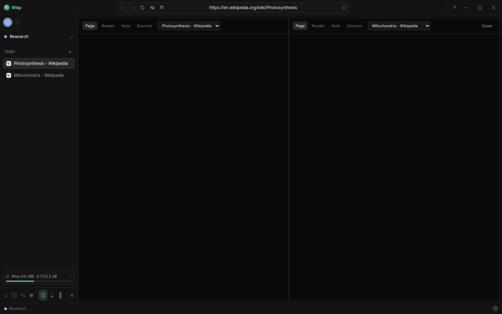

<!-- Wisp. © Shawy404, MIT. -->

<div align="center">


# Wisp

a browser i built for doing research. rooms, a search that actually digs, notes and a concept map, all sitting on your own disk.

`v0.1.7-pre-alpha` · Linux & Windows · [grab a build](../../releases) · by [Shawy404](https://github.com/Shawy404)


<sub>a room's concept map. concepts, notes and figures you drag in, all wired together. here it's the basics of a neuron.</sub>

</div>

---

## why

if you actually research stuff, your work is everywhere. forty tabs you're too scared to close, a notes app that has no idea what those tabs are, a citation thing that talks to neither. i got tired of it so i made this.

every topic you work on is a **room**. the tabs, sources, notes and map for that topic live inside it and swap in and out as you jump between rooms. nothing leaves your machine unless you ask it to. it's all just plain files under `~/Wisp/`.

the name is from *will o' the wisp*, the ghost light that leads people through the marsh. felt fitting.

## what it does

**rooms.** one room per topic. switch rooms and the whole workspace (tabs, sources, notes, map) swaps with it. close a room, open it again, everything is exactly where you left it.

**a search that isn't just google.** one bar hits Semantic Scholar, Crossref, arXiv, Wikipedia, Openverse and the web all at once, sorts what comes back into Academic / Overview / Images / Web, and lets you save the ones you like into the room with a click. no more copy pasting citations. there's a Wisp/Web toggle right there when you just want a normal web search.


<sub>one query, every source at once. keep the ones you want.</sub>

everything you save lands in the room's sources, tagged and ready to cite:


**notes and a concept map.** notes are plain markdown files with `[[wikilinks]]`, inline images, and `![[src-id]]` to embed a source. the map is that same stuff drawn as a graph: boxed nodes, photos for image sources, a few templates to start from, undo/redo and version history, drag to link, editable edge labels, and it auto links things when one note names another by title.


start a map from a template instead of a blank page. central topic, timeline, hierarchy, brainstorm, project plan:


**clip anything.** right click a page, some selected text, or an image to save it into the room. clip just a section and reopening it jumps you back to the exact spot, highlighted. on a youtube page you can clip the whole video or a time range, `yt-dlp` ships inside so there's nothing to install.

**two pages at once.** drag a tab to the edge and you get a real split, two live pages side by side (or a page and your notes). grab the line in the middle to resize them.



<sub>two live pages at the same time. read one, take notes on the other, whatever.</sub>

**it's a real browser under there.** find in page (`Ctrl+F`), full text search across the room (`Ctrl+Shift+F`), a download manager, tab sleeping to save memory, an ad and tracker blocker, reader mode, per site permission prompts, page zoom (pinch or Ctrl+wheel), and shortcuts that work even while a page has focus (hit `?` for the list).

**a password vault.** app wide, encrypted through your OS keychain, unlocked with your system password. log in somewhere and Wisp offers to save it, come back later and it fills the form for you.

**little stuff.** a per room focus timer you can set, sidebar bits for whatever tab is playing and your memory usage (with a one click "sleep the background tabs"), six themes with a custom accent, and a first run tour in english or turkish.

## install

grab a build from the [**releases**](../../releases) page. an `AppImage` for linux, an installer or portable `.exe` for windows. no setup, no dependencies. on windows Wisp tells you when a new one is out and downloads it inside the app when you say so, then installs on restart.

### or run it from source

you'll need [Node.js](https://nodejs.org) 20+ and git.

```bash
git clone https://github.com/Shawy404/Wisp.git
cd Wisp
npm install     # deps plus the electron binary
npm run dev     # start it, hot reload
```

build your own installable app:

```bash
npm run build:linux   # AppImage into dist/
npm run build:win     # installer and portable exe into dist/
```

the build pulls `yt-dlp` and bundles it so the thing you ship just works. if npm can't reach github for the electron binary, point `ELECTRON_MIRROR` at a mirror first.

## shortcuts

| key | does |
| --- | --- |
| `Ctrl+T` | command bar (new tab, search, commands) |
| `Ctrl+L` | jump to the address bar |
| `Ctrl+W` | close tab |
| `Ctrl+Tab` / `Ctrl+1…9` | cycle or jump to a tab |
| `Ctrl+F` | find in page |
| `Ctrl+Shift+F` | search the whole room |
| `?` | all the shortcuts |

on the map: shift click two nodes to link them, shift drag or `Ctrl+A` to select, `Delete` to remove, `Ctrl+Z` / `Ctrl+Shift+Z` to undo and redo.

## under the hood

electron, react, typescript, tailwind, built with electron-vite. cytoscape draws the map, codemirror the notes, `@mozilla/readability` the reader, `@ghostery/adblocker-electron` the blocking. the main process owns tabs (`WebContentsView`), search and the filesystem. the renderer is just the UI, behind a preload bridge with `contextIsolation` on.

it's all local, nothing leaves your machine beyond the searches you run. your stuff lives here (point `WISP_HOME` somewhere else if you want):

```
~/Wisp/
  config.json              settings
  vault.json               passwords (encrypted via the OS keychain)
  rooms/<room>/
    room.json              metadata and open tabs
    notes/*.md             notes (plain markdown)
    sources.json           saved sources
    map.json               concept nodes and links
    map-history.json       map version snapshots
    clips/                 clipped images, pages, video
```

## honest limitations

it's pre alpha so things will break, and the data format might still move around. no chrome extensions, no cloud sync, no mobile. trimmed video clips need `ffmpeg` on your system (whole video downloads work without it). autofill catches normal login forms, a few fully javascript ones slip past. the "web" search tab scrapes, so it can come back empty if that site changes its markup (the other tabs don't care).

## license

MIT, see [LICENSE](LICENSE). so basically, fuck around and find out. use it, fork it, ship it, break it. if my name ends up somewhere in your project that'd make me happy.
