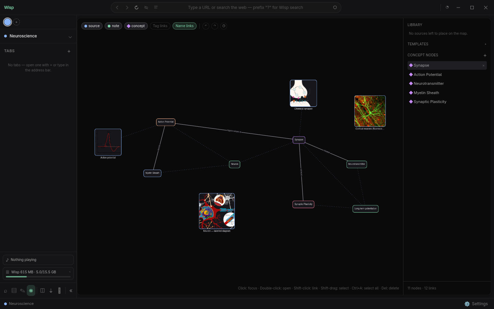
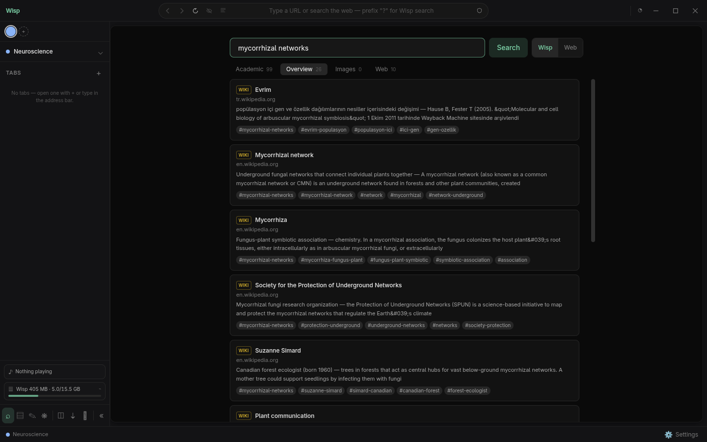
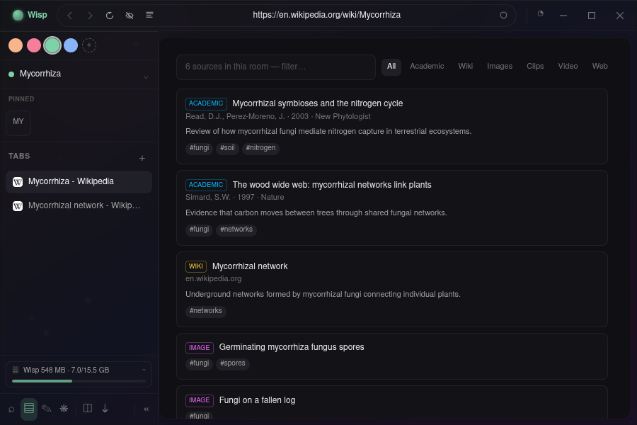
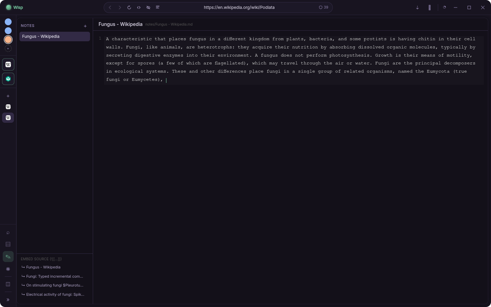
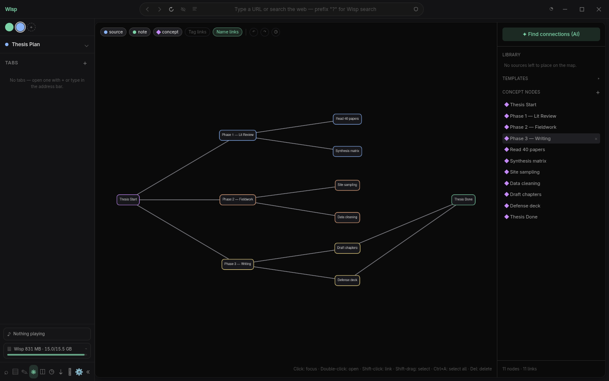

<!-- Wisp - © Shawy404. All rights reserved. -->

<div align="center">


# Wisp

**A browser built for research.** Rooms, clean search, notes and a concept map — all on your own disk.

`v0.1.6-pre-alpha` · Linux & Windows · [Download a build](../../releases) · Built by [Shawy404](https://github.com/Shawy404)



<sub>A room's concept map — concepts, notes and dropped-in figures, all linked. Here: the basics of a neuron.</sub>

</div>

---

## Why

If you do research, your work is scattered: forty tabs you're scared to close, a notes app that doesn't know what those tabs are, and a citation tool that talks to neither. Wisp puts them in one place.

Each topic you work on is a **room**. The tabs, sources, notes and concept map for that topic all live inside it and swap in and out as you move between rooms. Nothing leaves your machine unless you ask it to — everything is a plain file under `~/Wisp/`.

The name is from *will-o'-the-wisp*, the ghost light that leads travelers through the marsh.

## What it does

**Rooms.** One room per topic. Switch rooms and your whole workspace — tabs, sources, notes, map — swaps with it. Close and reopen a room and it's all exactly where you left it.

**Search that isn't just Google.** One search bar hits Semantic Scholar, Crossref, arXiv, Wikipedia, Openverse and the web at once, sorts the results into Academic / Overview / Images / Web, and lets you save the ones you want into the room with a click — no copy-pasting citations. A Wisp/Web toggle sits right next to it when you'd rather just search the web.



<sub>One query, every source at once — save the ones you want with a click.</sub>

Everything you save lands in the room's sources, tagged and ready to cite:



**Notes and a concept map.** Notes are plain markdown files, with `[[wikilinks]]`, inline images, and `![[src-id]]` to embed a source. The map is the same data as a graph: boxed nodes, photos for image sources, six ready-made templates to start from, undo/redo and version history, drag-to-link, editable edge labels, and auto-links when one note mentions another node by name.



Start a map from a template instead of a blank canvas — central topic, timeline, hierarchy, brainstorm, project plan:



**Clip anything.** Right-click a page, a text selection, or an image to save it into the room. Clip just a section and reopening it jumps back to the exact spot on the page, highlighted. On a YouTube page, clip the whole video or a time range — `yt-dlp` ships inside the app, nothing to install.

**A real browser underneath.** Find in page (`Ctrl+F`), full-text search across the room (`Ctrl+Shift+F`), a download manager, tab sleeping to save memory, an ad/tracker blocker, reader mode, per-site permission prompts, and keyboard shortcuts that work even while a page has focus (press `?` for the list).

**A password vault.** App-wide, encrypted through your OS keychain, unlocked with your system password. Log in somewhere and Wisp offers to save it; come back and it fills the form for you.

**Little comforts.** A per-room focus timer with adjustable length, sidebar widgets for the currently-playing tab and memory usage (with a one-click "sleep background tabs"), six themes with a custom accent, and a first-run tour in English or Turkish.

## Install

Grab a ready build from the [**Releases**](../../releases) page — an `AppImage` for Linux, an installer or portable `.exe` for Windows. No setup, no dependencies. On Windows, Wisp tells you when a new release is out and downloads it inside the app when you choose to, then installs on restart.

### Or run it from source

You'll need [Node.js](https://nodejs.org) 20+ and git.

```bash
git clone https://github.com/Shawy404/Wisp.git
cd Wisp
npm install     # dependencies + the Electron binary
npm run dev     # start Wisp, hot reload
```

Build your own installable app:

```bash
npm run build:linux   # AppImage → dist/
npm run build:win     # installer + portable exe → dist/
```

The build downloads `yt-dlp` and bundles it, so the app you ship works out of the box. If npm can't reach GitHub for the Electron binary, set `ELECTRON_MIRROR` to a mirror first.

## Shortcuts

| Key | Action |
| --- | --- |
| `Ctrl+T` | Command bar — new tab, search, commands |
| `Ctrl+L` | Focus the address bar |
| `Ctrl+W` | Close tab |
| `Ctrl+Tab` / `Ctrl+1…9` | Cycle / jump to tab |
| `Ctrl+F` | Find in page |
| `Ctrl+Shift+F` | Search the whole room |
| `?` | All shortcuts |

On the map: shift-click two nodes to link, shift-drag or `Ctrl+A` to select, `Delete` to remove, `Ctrl+Z` / `Ctrl+Shift+Z` to undo/redo.

## Under the hood

Electron + React + TypeScript + Tailwind, built with electron-vite. Cytoscape drives the map, CodeMirror the notes, `@mozilla/readability` the reader, `@ghostery/adblocker-electron` the blocking. The main process owns tabs (`WebContentsView`), search and the filesystem; the renderer is UI only, behind a preload bridge with `contextIsolation` on.

Everything is local — nothing leaves your machine beyond the searches you run. Your data lives here (override with `WISP_HOME`):

```
~/Wisp/
  config.json              global settings
  vault.json               passwords (encrypted via the OS keychain)
  rooms/<room>/
    room.json              metadata + open tabs
    notes/*.md             notes (plain markdown)
    sources.json           collected sources
    map.json               concept nodes + links
    map-history.json       map version snapshots
    clips/                 clipped images / pages / video
```

## Honest limitations

- Pre-alpha. Things will break; the data format may still shift.
- No Chrome extensions, no cloud sync, no mobile.
- Video clipping needs `ffmpeg` on your system for trimmed ranges (whole-video downloads work without it).
- Password autofill catches ordinary login forms; a few fully-JavaScript logins may slip past.
- The "Web" search tab scrapes results, so it can come back empty if that source changes its markup (the other tabs are unaffected).

## License

© Shawy404. All rights reserved.
